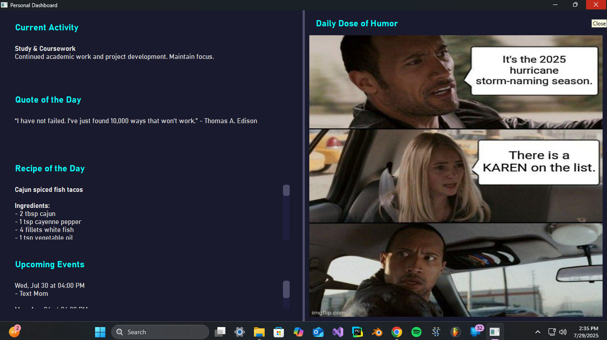

# Personal Dashboard

A personal desktop dashboard application built with Python and PySide6. 
It displays live data from several sources to provide an at-a-glance view of daily information.

## Features

*   **Current Activity:** Tracks and displays the user's scheduled activity based on a predefined daily schedule, updating every second.
*   **Quote of the Day:** Scrapes a random quote from quotes.toscrape.com.
*   **Recipe of the Day:** Fetches a random recipe, including ingredients and instructions, from TheMealDB API.
*   **Upcoming Events:** Connects to the Google Calendar API to show the next upcoming events.
*   **Daily Dose of Humor:** Scrapes a trending meme from Imgflip.

## Setup & Usage

To run this application on your own machine, please follow these steps:

1.  **Clone the repository:**
    ```bash
    git clone https://github.com/YourUsername/PersonalDashboard.git
    cd PersonalDashboard
    ```

2.  **Create and activate a virtual environment:**
    ```bash
    python -m venv .venv
    # On Windows
    .\.venv\Scripts\activate
    ```

3.  **Install dependencies:**
    ```bash
    pip install -r requirements.txt
    ```

4.  **Add Google API Credentials:**
    *   Follow the Google Cloud instructions to create an **OAuth client ID for a Desktop app**.
    *   Download the `credentials.json` file and place it in the root of the project directory.

5.  **Run the application:**
    ```bash
    python main.py
    ```

## Screenshot

